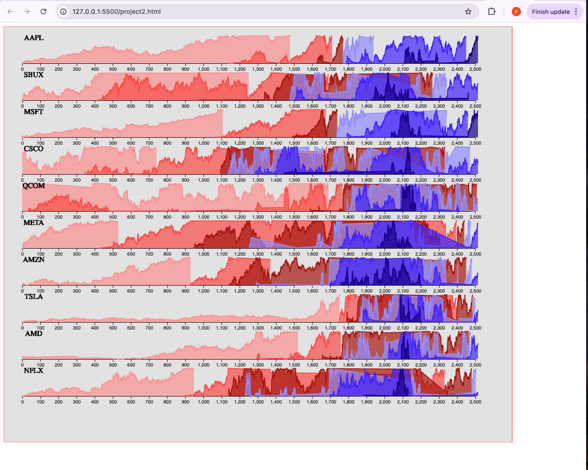

# Horizon Graph Visualization of Stock Market Data

## **Goals**
1. Read stock market history data for a set of companies.
2. Process the data into 6 categories of values.
3. Convert the data into path objects for plotting.
4. Visualize the data using **Horizon Graphs**.

---

## **References**
- Lecture slides on Horizon Graph Visualization.
- Stephen Few's book on **Horizon Graph Visualization**.
- [SVG Paths Documentation](https://developer.mozilla.org/en-US/docs/Web/SVG/Tutorial/Paths).
- Lab 3A example on SVG paths.

---

## **Dataset**
- **Filename**: `data.csv`
- **Content**: Stock history data of 10 technology companies from July 2013 to July 2023.
- **Fields Used**: Only the stock share values indexed by company ticker name.

---

## **Example Output**
The Horizon Graph will display:
1. **Red segments** for values below 0.5.
2. **Blue segments** for values above 0.5.
3. Smooth transitions between categories.
4. Vertical stacking of each company's graph with labeled axes.

---

